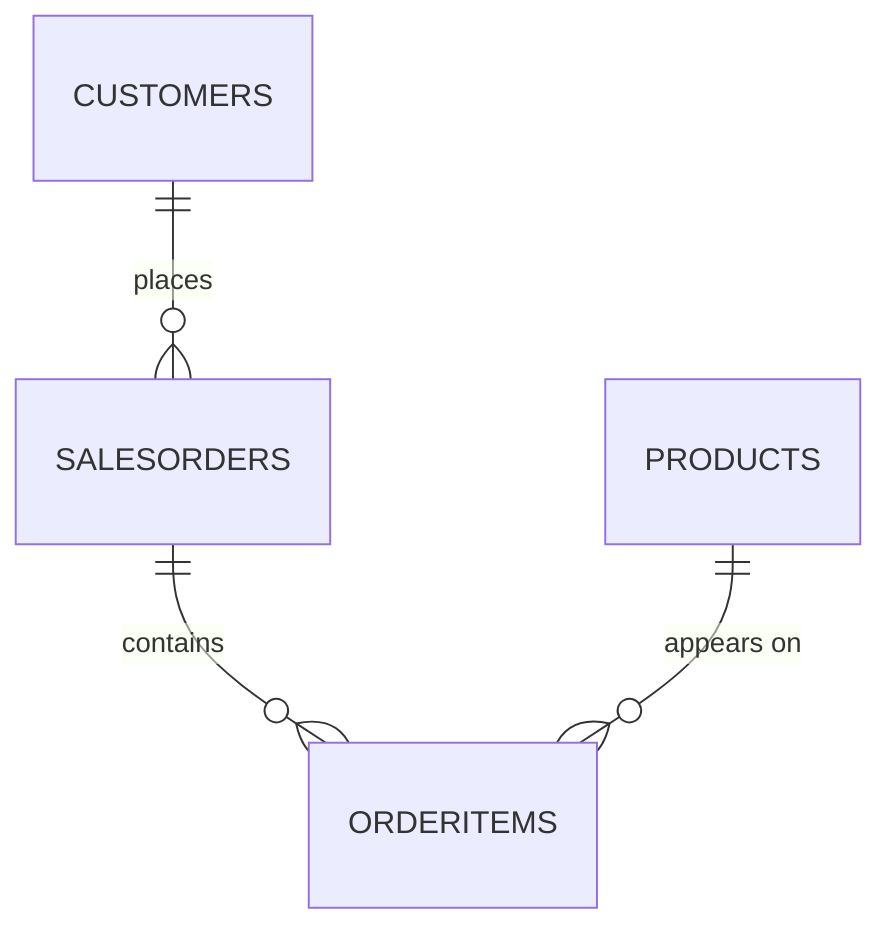

# SAP HANA Query Optimizer — An Evidence-Based Study

Seven SQL queries executed on **SAP HANA Cloud**, each captured with its real
execution plan, and read closely enough to say what the optimizer actually did —
including the case where it did **not** do what the textbooks promise.

> The point of this repository is not that the queries return correct rows.
> It is that every claim made about SAP HANA here is backed by a plan artifact
> committed alongside it, and where the evidence contradicts conventional
> wisdom, the contradiction is reported rather than smoothed over.

**Environment** — SAP HANA Cloud (`HSF_DB`), schema `NSHARMA`, SAP HANA Database
Explorer · HEX execution engine · all tables COLUMN store · dataset deliberately
tiny (23 rows) so every plan fits on one screen and can be verified by hand.

---

## Contents

| Path | What it holds |
|---|---|
| [`sql/01_schema_and_seed.sql`](sql/01_schema_and_seed.sql) | DDL, seed data, verification queries, documented data-quality defect |
| [`sql/02_queries_annotated.sql`](sql/02_queries_annotated.sql) | The seven queries, each with its transcribed plan and line-by-line analysis |
| [`plans/`](plans/) | Raw `EXPLAIN PLAN` exports, one CSV per query — the primary evidence |
| [`screenshots/`](screenshots/) | HANA Database Explorer result sets, one JPG per query |

Every assertion below is traceable to a file in `plans/`.

---

## The data model

Classic order-to-cash: two dimensions, a fact header, and a fact line.



| Table | Rows | Key columns | Role |
|---|---|---|---|
| `CUSTOMERS` | 5 | `CustomerID` **PK** · Region, CreditLimit | dimension |
| `PRODUCTS` | 5 | `ProductID` **PK** · Category, UnitPrice, StockQty | dimension |
| `SALESORDERS` | 6 | `OrderID` **PK** · `CustomerID` **FK** · OrderDate, Status, TotalValue | fact header |
| `ORDERITEMS` | 7 | `OrderItems` **PK** · `OrderID` **FK**, `ProductID` **FK** · Quantity, LineTotal | fact line |

Full column definitions are in [`sql/01_schema_and_seed.sql`](sql/01_schema_and_seed.sql).

The **declared foreign keys are load-bearing for this study**. Every
`MANY-TO-ONE INDEX JOIN` in `plans/` is a direct consequence of them: the
constraint is what lets HANA *prove* the right side cannot duplicate rows, and
that proof is what turns a join into a cheap index probe.

---

## Method

For each query:

```sql
EXPLAIN PLAN SET STATEMENT_NAME = 'Qn' FOR <query>;
SELECT * FROM SYS.EXPLAIN_PLAN_TABLE WHERE STATEMENT_NAME = 'Qn';
```

The result was exported unmodified to `plans/Qn_*.csv`. The columns that carry
the analysis are `OPERATOR_NAME`, `OPERATOR_DETAILS`, `OPERATOR_PROPERTIES`,
`TABLE_SIZE`, `OUTPUT_SIZE` and `SUBTREE_COST`; `LEVEL` and
`PARENT_OPERATOR_ID` reconstruct the tree.

**On the cost numbers.** `SUBTREE_COST` is the optimizer's unitless *estimate*,
not a measured runtime. On a 23-row dataset the absolute values are
meaningless — the **ordering and the ratios** are what carry information, and
that is the only way they are used here.

---

## The seven queries at a glance

| # | Pattern | Est. cost | vs. cheapest | What the plan proves |
|---|---|---|---|---|
| Q2 | Filtered scan | `0.089e-6` | 1.0× | Predicate fused into the scan — no filter operator exists |
| Q7 | `EXISTS` | `0.654e-6` | 7.3× | Correlated `EXISTS` → single `INDEX JOIN (SEMI)` |
| Q1 | Single-table `GROUP BY` | `1.347e-6` | 15.1× | `VALUE_ID GROUPING` + `PERFECT_HASH` |
| Q3 | Two-table join | `1.637e-6` | 18.3× | PK/FK proof yields `MANY-TO-ONE INDEX JOIN` |
| Q4 | Four-table join | `3.564e-6` | 39.9× | **Join order rewritten** — execution ≠ written order |
| Q5 | Aggregation over join | `6.720e-6` | 75.2× | `PERFECT_HASH` *lost* because the key crosses a join |
| Q6 | Repeated subquery | `7.418e-6` | 83.1× | **Duplicate work not eliminated** |

---

## Finding 1 — HANA rewrote the join order (Q4)

Four tables, three joins. What was written, and what ran:

```
WRITTEN     SalesOrders ─→ Customers ─→ OrderItems ─→ Products
EXECUTED    OrderItems  ─→ SalesOrders ─→ Customers ─→ Products
```

The plan bottoms out at `TABLE SCAN ORDERITEMS` — the table named **third** in
the `FROM` clause.

```
PROJECT
└─ ORDER BY  SO.ORDERID ASC
   └─ INDEX JOIN  MANY-TO-ONE  OI.PRODUCTID = P.PRODUCTID      [probe PRODUCTS]
      └─ INDEX JOIN  ONE-TO-MANY  C.CUSTOMERID = SO.CUSTOMERID [probe CUSTOMERS]
         │           enum: JOIN_THRU_JOIN
         └─ INDEX JOIN  ONE-TO-MANY  SO.ORDERID = OI.ORDERID   [probe SALESORDERS]
            │           enum: JOIN_THRU_JOIN
            └─ TABLE SCAN  ORDERITEMS   (7 rows)
```

**Why OrderItems leads.** It is the lowest-granularity table and the only one
holding foreign keys into *both* remaining branches, so every other table is
reachable by a single primary-key probe. Driving from it keeps the row count
flat: 7 rows enter the scan, 7 rows leave the top join. Driving from Customers
instead would have expanded 5 rows into 7 mid-plan.

Two further details worth noting:

- `JOIN_THRU_JOIN` — the named rewrite that authorised the reassociation —
  appears on the two inner joins but **not** on the topmost one. The plan
  records exactly which joins were moved.
- The same logical predicate flips direction between queries. Q3 records
  `MANY-TO-ONE` on `SO.CUSTOMERID = C.CUSTOMERID`; Q4 records the identical
  predicate as `ONE-TO-MANY`, because it is now traversed from the other side.

Four tables, three joins, and still **only one table scan** — the rest are
index probes.

*Evidence:* [`plans/Q4_multi_join.csv`](plans/Q4_multi_join.csv)

---

## Finding 2 — The optimizer did *not* deduplicate a repeated subquery (Q6)

This was the hypothesis under test: write the same correlated subquery twice —
once for the value, once inside a `CASE` — and see whether HANA computes it once.

**It computes it twice.** The plan contains two byte-identical subtrees:

```
PROJECT
└─ HASH JOIN (LEFT OUTER)  C.CUSTOMERID = SO.CUSTOMERID
   │                       HASH SIZE: 5, RIGHT SIDE HASH
   │                       enum: AGGR_THRU_JOIN
   ├─ INDEX JOIN (LEFT OUTER)  C.CUSTOMERID = SO.CUSTOMERID
   │  └─ AGGREGATION  GROUP BY SO.CUSTOMERID, SUM(OI.LINETOTAL)   ← subtree A
   │     └─ INDEX JOIN  OI.ORDERID = SO.ORDERID
   │        └─ TABLE SCAN  ORDERITEMS                             ← scan #1
   │
   └─ AGGREGATION  GROUP BY SO.CUSTOMERID, SUM(OI.LINETOTAL)      ← subtree B
      └─ INDEX JOIN  OI.ORDERID = SO.ORDERID
         └─ TABLE SCAN  ORDERITEMS                                ← scan #2
```

`ORDERITEMS` is scanned twice. Subtrees A and B cost `2.47e-6` each and together
account for most of the query's `7.42e-6`.

**But the same plan also shows a genuinely sophisticated rewrite.** The query
*reads* as "for each of the 5 customers, run this join and sum" — and that is
not what executes. `AGGR_THRU_JOIN` decorrelated the scalar subquery into a
single `GROUP BY so.CustomerID` computed once for all customers, then joined
back. The `LEFT OUTER` is HANA preserving scalar-subquery semantics: a customer
with no orders must yield `NULL`, not disappear.

So the honest verdict is split:

| | Outcome |
|---|---|
| Decorrelation of the correlated subquery | **Succeeded** — no per-row execution |
| Common-subexpression elimination of the duplicate | **Did not happen** |

The top operator is a `HASH JOIN` rather than an index join for a reason worth
spelling out: subtree B produces a *computed* aggregate, not a stored table, so
there is no index to probe and a hash table must be built. **That hash build
exists only because the subquery was duplicated** — it is the structural cost of
the missing deduplication, visible in the plan shape itself.

**Takeaway:** "the optimizer will spot it for you" is not a safe assumption.
A CTE makes the intent explicit and collapses subtree B — the rewrite is given
in [`sql/02_queries_annotated.sql`](sql/02_queries_annotated.sql). *Not proven:*
the CTE variant has not been `EXPLAIN`'d here, so no measured speedup is
claimed. What is proven is that the current plan contains two identical subtrees
where one would do.

*Evidence:* [`plans/Q6_repeated_subquery.csv`](plans/Q6_repeated_subquery.csv)

---

## Finding 3 — `EXISTS` became a semi-join (Q7)

`EXISTS` reads as though it should run once per outer row. It does not:

```
PROJECT
└─ INDEX JOIN (SEMI)  ONE-TO-MANY  C.CUSTOMERID = SO.CUSTOMERID
   │                  LEFT SIDE INDEX   (est. output 4.5 rows)
   └─ TABLE SCAN  SALESORDERS  (6 rows)
```

No loop, no subplan, no re-execution — one set operation. `SEMI` is the property
that makes it correct: a semi-join emits each left row **at most once** and stops
probing at the first match, which is precisely `EXISTS` semantics. A plain join
would have returned *Nordic Retail GmbH* twice, since it has two orders; the
result set correctly shows it once.

Two details the plan gives away for free:

- **`SELECT 1` is never evaluated.** The projected columns are `CUSTOMERNAME,
  REGION` only. Writing `SELECT *` inside the `EXISTS` would produce an
  identical plan.
- **Estimated ≠ actual.** `OUTPUT_SIZE` is `4.5` — a fractional row count, so
  necessarily an estimate. The real answer is 5 rows. HANA under-estimated by
  10% because its selectivity model assumes independence and cannot know that
  all five customers happen to have placed orders. A useful reminder that these
  plans record the optimizer's *beliefs*, not measurements.

At `0.654e-6`, Q7 is **2.5× cheaper than the visually similar join in Q3** and
**11× cheaper than Q6**. That last gap is not "`EXISTS` beats `SUM`" — it is
that Q7's single subquery was rewritten into one set operation while Q6's
duplicated subquery was rewritten into two.

*Evidence:* [`plans/Q7_exists_semijoin.csv`](plans/Q7_exists_semijoin.csv)

---

## Secondary observations

**Filtering made the query cheaper, not more expensive (Q2 vs Q1).** Both read
`PRODUCTS`. Q2 adds a `WHERE` clause and costs **15× less**. The plan shows no
filter operator at all — the predicate was fused into the scan
(`FILTER CONDITION ... DETAIL: ([SCAN] ...)`), so HANA produces 1 row rather than
producing 5 and discarding 4. `TABLE_SIZE 5 → OUTPUT_SIZE 1` quantifies it:
80% of rows eliminated before anything above the scan existed.

**A join can cost you `PERFECT_HASH` (Q1 vs Q5).** Both group three categories.
Q1 gets `VALUE_ID GROUPING, PERFECT_HASH`; Q5 gets `VALUE_ID GROUPING` **only**.
In Q1 the grouping key comes straight off a base column, so the exact dictionary
cardinality is known and a collision-free table can be sized up front. In Q5 the
key arrives through a join, the distinct count becomes an estimate, and HANA
falls back to a general hash. Same `GROUP BY`, weaker guarantee, purely because
a join sits underneath.

**The optimizer pushes aggregation below a join — sometimes.** Q5 keeps
`AGGREGATION` *above* the join; Q6's `AGGR_THRU_JOIN` pushes it *below* one.
Same optimizer, opposite decisions, turning on whether the grouping key survives
the pushdown.

**Sub-linear join scaling.** Q3 (1 join) `1.637e-6` → Q4 (3 joins) `3.564e-6`:
2.2× the cost for 3× the joins. Each added primary-key probe is cheaper than the
last, because the driving row count never grows.

**Casts you did not write.** Q1's `OPERATOR_DETAILS` exposes implicit
`TO_DECIMAL(...,20,2)` and `TO_DECIMAL(...,20,0)` conversions —
`DECIMAL(10,2) * INTEGER` forces a widening cast. Free on 5 rows; not free on a
wide fact table.

---

## Data-quality and correctness notes

Two defects were found during the study and are **documented in place rather
than quietly patched**, so that the committed SQL still matches the committed
plans:

1. **`SalesOrders.TotalValue` does not reconcile with its line items.**
   Order 1001: header `1799.48` vs lines `1799.88` (Δ −0.40). Order 1005:
   header `2015.75` vs lines `2021.90` (Δ −6.15). The line values are correct
   (12 × 149.99; 10 × 149.99 + 8 × 65.25). This is why Q6 — which recomputes
   from lines rather than trusting the header — reports higher totals than a
   naive `SUM(TotalValue)` would. A reconciliation query is included at the
   bottom of [`sql/01_schema_and_seed.sql`](sql/01_schema_and_seed.sql).

2. **Q5's alias `ItemsSold` is misleading.** `COUNT(DISTINCT oi.OrderID)` counts
   *orders*, not items. The two coincide in this dataset and would diverge the
   moment one order contained two lines from the same category. The honest name
   is `DistinctOrders`.

A third item is cosmetic and preserved for fidelity: Q6's alias reads
`CutomerTier` in the executed statement, so it reads that way here too.

---

## Reproducing this

1. Provision an SAP HANA Cloud instance and open SAP HANA Database Explorer.
2. Run [`sql/01_schema_and_seed.sql`](sql/01_schema_and_seed.sql). The
   verification queries should return `5 / 5 / 6 / 7`, and the smoke-test join
   should return exactly 7 rows.
3. Run any query from [`sql/02_queries_annotated.sql`](sql/02_queries_annotated.sql)
   wrapped in `EXPLAIN PLAN SET STATEMENT_NAME = 'Qn' FOR ...`, then read
   `SYS.EXPLAIN_PLAN_TABLE`.
4. Compare against the corresponding CSV in `plans/`. Operator *shapes* should
   match; absolute costs will differ with instance sizing and statistics.

---

## Scope and honesty statement

- The dataset is 23 rows. It is sized for **plan legibility**, not for
  benchmarking. No throughput or latency claim is made anywhere in this repo.
- All costs are optimizer estimates. Nothing here was timed with a stopwatch.
- Where a plan did not prove a claim, the claim is marked **NOT PROVEN** in the
  annotations rather than asserted.
- The most interesting result in this repository is a **negative** one (Q6):
  the optimizer failed to do something widely assumed to be automatic. It is
  reported as found.
